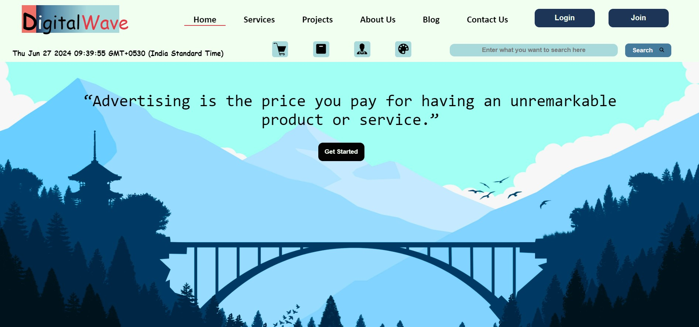

# DigitalWave 🎯📢🔔🖥

### Digital Advertising Enhancement Web Application 

DigitalWave is a full-stack web application designed to revolutionize the user experience in the digital advertising sector. By focusing on ease of use, efficiency, and advanced features, this application empowers users to seamlessly navigate and manage digital advertising tasks. It showcases a blend of cutting-edge web technologies and a structured development approach.

## Key Features
##### Enhanced User Experience: A user-friendly interface to simplify interactions with digital advertising tools.
##### Dynamic Content Management: Easily manage and update advertising content without technical expertise.
##### Data Integration: Efficient handling and processing of advertising data using MySQL.
##### Scalable Architecture: Developed using the MVC (Model-View-Controller) architecture to ensure scalability and maintainability.

## Technologies Used
``Frontend: HTML, CSS, JavaScript``
``Backend: PHP``
``Database: MySQL``
``Development Pattern: MVC Architecture``

## Development Process
- Team Leadership: Managed a team of 4 developers to ensure on-time delivery of all project milestones.
- Design & Development: Created a clean, interactive UI/UX using HTML, CSS, and JavaScript. Backend logic and database integrations were implemented using PHP and MySQL.
- Deployment: Successfully deployed the application, ensuring performance optimization and secure database handling.

## Highlights
- Collaboration: Fostered a collaborative environment, aligning team efforts with project goals.
- Code Modularity: Implemented modular coding practices adhering to MVC principles, making the application easy to extend and maintain.
- Database Optimization: Utilized efficient database queries and indexing for fast and reliable data retrieval.
